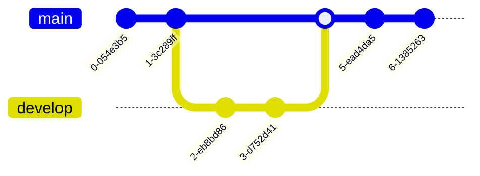

```mermaid
gitGraph
       commit
       commit
       branch develop
       checkout develop
       commit
       commit
       checkout main
       merge develop
       commit
       commit
```
# Versionamento

## 🔎 *Referências e Documentação*📗

- [Diagrama Markdow](https://support.typora.io/Draw-Diagrams-With-Markdown/)