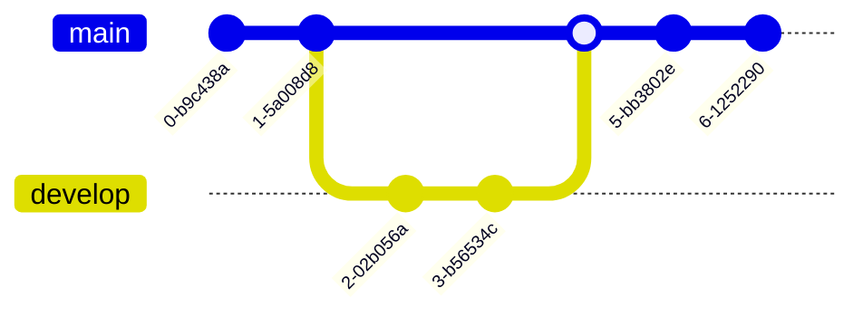
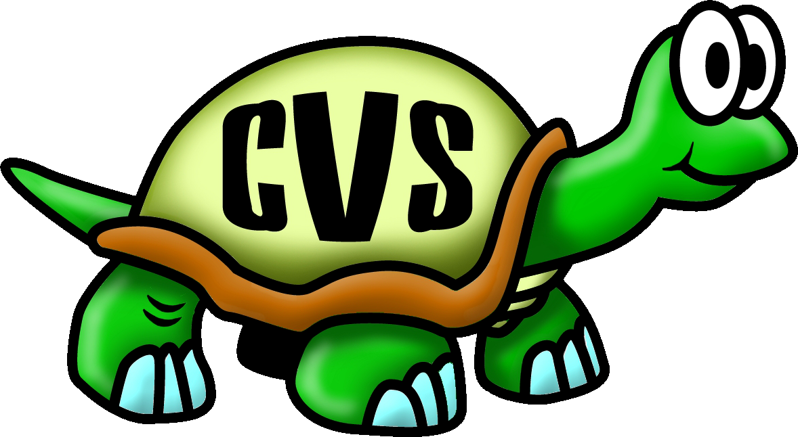

```mermaid
gitGraph
       commit
       commit
       branch develop
       checkout develop
       commit
       commit
       checkout main
       merge develop
       commit
       commit
```
# Versionamento de código

O versionamento de código é realizadop com um sistema de controle de versão que: 
- Controlam as versões de um arquivo ao longo do tempo;
- Registra o histórico de atualizações de um arquivo;
- Gerencia quais foram as alterações, a data, o autor, etc. (organização controle e segurança).

### Tipos de sistemas de controle de versão

* VCS Centralizado (CVCS)
  * TortoiseCVS
   
  * Subversion 
   
  
 

- VCS Distribuido (DVCS)
  - Git
   
  - Mercurial
   

 

##  Git   

[Git SCM - Source Code management](https://git-scm.com/) é um sistema de controle de versão.
- Gratuito e Open Source;
- Ramificações (branching) e fusões (merging) eficientes;
- Leve e rápido

## 🔎 *Referências e Documentação*📗

- [Documentação Git](https://git-scm.com/doc)
- [Diagrama Markdow](https://support.typora.io/Draw-Diagrams-With-Markdown/)

 

### [Voltar](../README.md) | [Aula 2](resumo-aula2.md)
